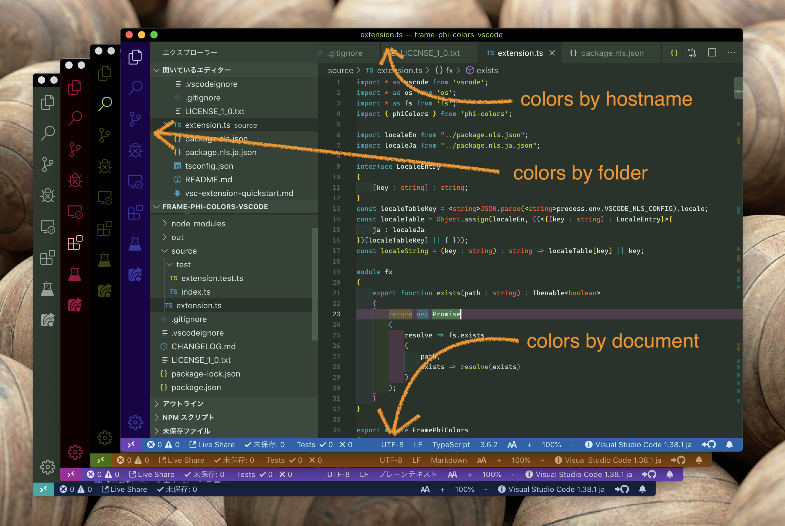
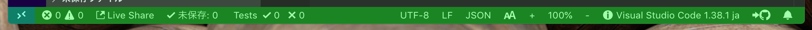
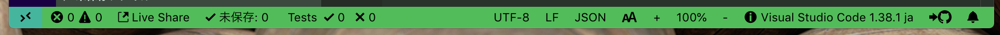
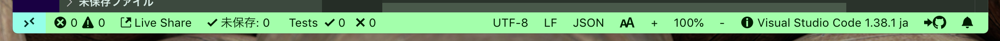
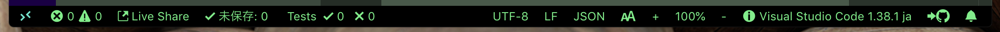

# Frame Phi Colors README

⚠️ This extension automatically and frequently edits settings.json.

⚠️ It is necessary to delete the settings manually when uninstalling. see [Uninstall Notes](#uninstall-notes).

This extension automatically colors the title bar, activity bar, and status bar.

## Coloring Style

### posi-light

### posi-dark

### nega-light

### nega-dark

## Tutorial

### 0. ⬇️ Install Frame Phi Colors

Show extension side bar within VS Code(Mac:<kbd>Command</kbd>+<kbd>Shift</kbd>+<kbd>X</kbd>, Windows and Linux: <kbd>Ctrl</kbd>+<kbd>Shift</kbd>+<kbd>X</kbd>), type `frame-phi-colors` and press <kbd>Enter</kbd> and click <kbd>Install</kbd>. Restart VS Code when installation is completed.

### 1. 🌈 Colors frame

Open folders and text files. The frame color changes automatically.

### 2. 🔧 Next step

You can change [settings](#extension-settings) by `settings.json`.

Enjoy!

## Commands

This extension has no commands.

## Extension Settings

This extension contributes the following settings by [`settings.json`](https://code.visualstudio.com/docs/customization/userandworkspace#_creating-user-and-workspace-settings)( Mac: <kbd>Command</kbd>+<kbd>,</kbd>, Windows / Linux: <kbd>File</kbd> -> <kbd>Preferences</kbd> -> <kbd>User Settings</kbd> ):

* `framePhiColors.applyScope`: directory conditions for automatic frame coloring
* `framePhiColors.baseColor`: arranges and colors based on this color. ( #RRGGBB )
* `framePhiColors.titleBarColorSource`: source to arrange title bar colors
* `framePhiColors.activityBarColorSource`: source to activity title bar colors
* `framePhiColors.statusBarColorSource`: source to activity status bar colors
* `framePhiColors.statusBarDebuggingColorSource`: source to arrange status bar color while debugging
* `framePhiColors.titleBarColoringStyle`: title bar coloring style
* `framePhiColors.activityBarColoringStyle`: activity bar coloring style
* `framePhiColors.statusBarColoringStyle`: status bar coloring style
* `framePhiColors.statusBarDebuggingColoringStyle`: status bar coloring style while debugging
* `framePhiColors.statusBarNoFolderColoringStyle`: status bar coloring style when folder is not open

## Uninstall Notes

Frame Phi Colors edits workbench.colorCustomizations in settings.json( both user and workspace ).
Please delete workbench.colorCustomizations from settings.json( both user and workspace ) when you uninstalled this extension.

cf. https://code.visualstudio.com/docs/getstarted/settings ( You need to edit the JSON files. )

## Release Notes

see ChangLog on [marketplace](https://marketplace.visualstudio.com/items/wraith13.frame-phi-colors/changelog) or [github](https://github.com/wraith13/frame-phi-colors/blob/master/CHANGELOG.md)

## Support

[GitHub Issues](https://github.com/wraith13/frame-phi-colors-vscode/issues)

## License

[Boost Software License](https://github.com/wraith13/frame-phi-colors-vscode/blob/master/LICENSE_1_0.txt)
